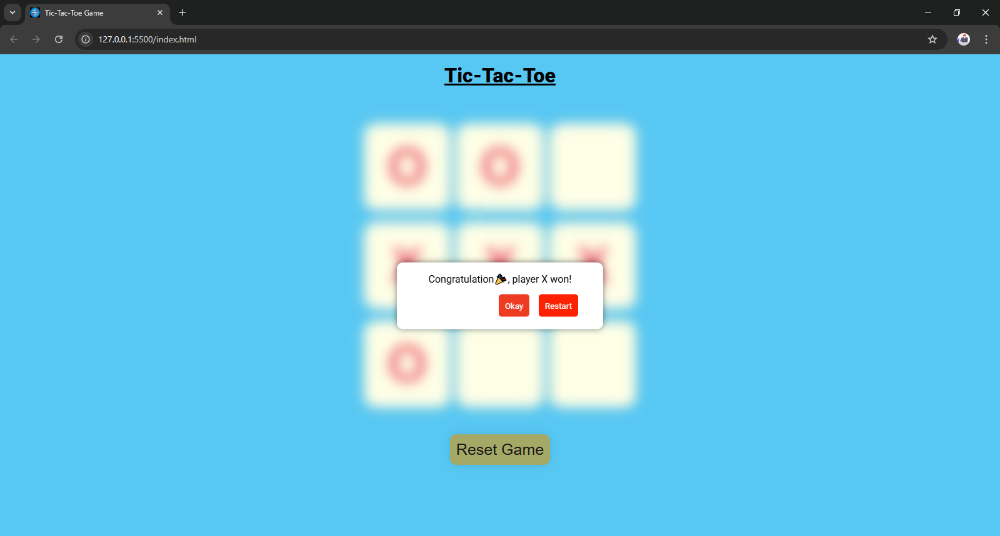
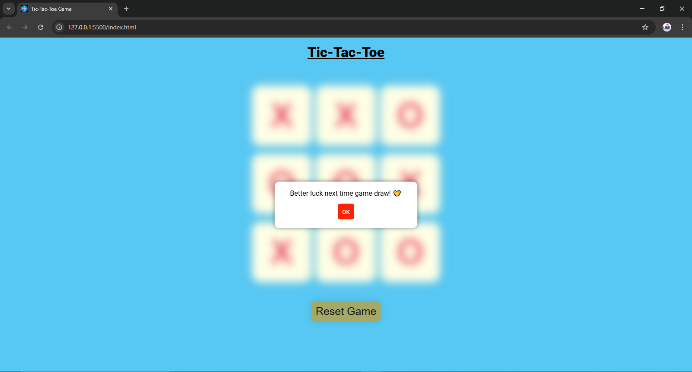
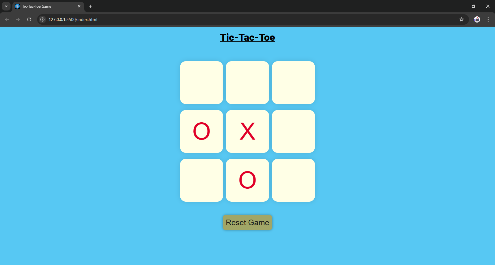
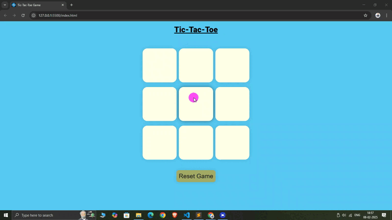

# **Tic-Tac-Toe (JavaScript)**  

A simple **Tic-Tac-Toe** game built using **HTML, CSS, and JavaScript**. This project provides an interactive UI, smooth gameplay, and prevents players from making invalid moves.  

## **Features**  
✅ Two-player mode (X vs O)  
✅ Prevents overwriting moves  
✅ Simple and responsive UI  

## **Installation & Setup**  
1. Clone this repository:  
     git clone https://github.com/skandalkar/JavaScript-Tic-Tac-Toe.git 
2. Open the project folder.  
3. Run `index.html` in a browser.  

## **How to Play**  
1. **Player O** starts the game.  
2. Click on an empty cell to place your mark.  
3. The turn switches automatically.  
4. The game ends when a player wins or all cells are filled (draw).  

## **Technologies Used**  
- **HTML** – For structuring the game board  
- **CSS** – For styling the board and animations  
- **JavaScript** – For game logic and interactions  

## **Code Explanation**  
- **`index.html`** → Creates the game layout  
- **`style.css`** → Handles the UI design  
- **`script.js`** → Implements game logic, move validation, and turn switching  

## **Future Enhancements**  
🚀 Add AI for single-player mode  
🚀 Improve animations & sounds  
🚀 Track player scores  

## **Contributing**  
Feel free to **fork** this repo, improve it, and create a **pull request**!  

## **Outputs**
**Here are some images:**
  
   
   
   

Tic Tac Toe Gameplay:
 

